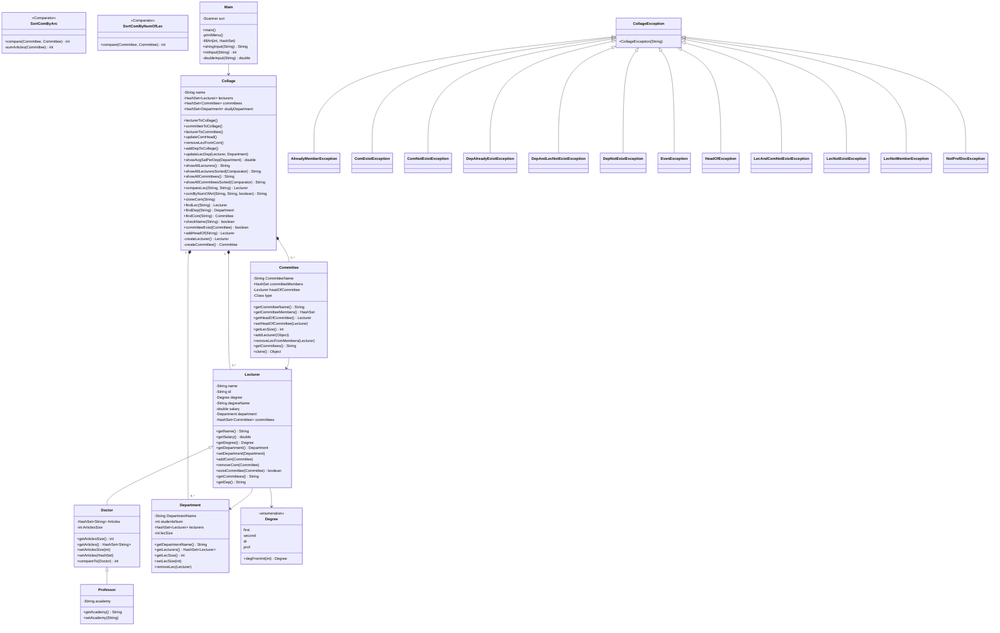

# College Management System - Class Diagram

```mermaid
classDiagram

    class Collage {
        -String name
        -HashSet~Lecturer~ lecturers
        -HashSet~Committee~ committees
        -HashSet~Department~ studyDepartment
        +lecturerToCollage()
        +committeeToCollage()
        +lecturerToCommittee()
        +updateComHead()
        +removeLecFromCom()
        +addDepToCollege()
        +updateLecDep(Lecturer, Department)
        +showAvgSalPerDep(Department) double
        +showAllLecturers() String
        +showAllLecturersSorted(Comparator) String
        +showAllCommittees() String
        +showAllCommitteesSorted(Comparator) String
        +compareLec(String, String) Lecturer
        +comByNumOfArt(String, String, boolean) String
        +cloneCom(String)
        +findLec(String) Lecturer
        +findDep(String) Department
        +findCom(String) Committee
        +checkName(String) boolean
        +committeeExist(Committee) boolean
        +addHeadOf(String) Lecturer
        -createLecturer() Lecturer
        -createCommittee() Committee
    }

    class Lecturer {
        -String name
        -String id
        -Degree degree
        -String degreeName
        -double salary
        -Department department
        -HashSet~Committee~ committees
        +getName() String
        +getSalary() double
        +getDegree() Degree
        +getDepartment() Department
        +setDepartment(Department)
        +addCom(Committee)
        +removeCom(Committee)
        +existCommittee(Committee) boolean
        +getCommittees() String
        +getDep() String
    }

    class Doctor {
        -HashSet~String~ Articles
        -int ArticlesSize
        +getArticlesSize() int
        +getArticles() HashSet~String~
        +setArticlesSize(int)
        +setArticles(HashSet)
        +compareTo(Doctor) int
    }

    class Professor {
        -String academy
        +getAcademy() String
        +setAcademy(String)
    }

    class Committee {
        -String CommitteeName
        -HashSet committeeMembers
        -Lecturer headOfCommittee
        -Class type
        +getCommitteeName() String
        +getCommitteeMembers() HashSet
        +getHeadOfCommittee() Lecturer
        +setHeadOfCommittee(Lecturer)
        +getLecSize() int
        +addLecturer(Object)
        +removeLecFromMembers(Lecturer)
        +getCommittees() String
        +clone() Object
    }

    class Department {
        -String DepartmentName
        -int studentsNum
        -HashSet~Lecturer~ lecturers
        -int lecSize
        +getDepartmentName() String
        +getLecturers() HashSet~Lecturer~
        +getLecSize() int
        +setLecSize(int)
        +removeLec(Lecturer)
    }

    class Degree {
        <<enumeration>>
        first
        second
        dr
        prof
        +degFromInt(int) Degree
    }

    class SortComByArc {
        <<Comparator>>
        +compare(Committee, Committee) int
        -sumArticles(Committee) int
    }

    class SortComByNumOfLec {
        <<Comparator>>
        +compare(Committee, Committee) int
    }

    class Main {
        -Scanner scn
        +main()
        -printMenu()
        -fillArt(int, HashSet)
        +stringInput(String) String
        +intInput(String) int
        -doubleInput(String) double
    }

    class CollageException {
        +CollageException(String)
    }

    class AlreadyMemberException {
    }
    class ComExistException {
    }
    class ComNotExistException {
    }
    class DepAlreadyExistException {
    }
    class DepAndLecNotExistException {
    }
    class DepNotExistException {
    }
    class EvenException {
    }
    class HeadOfException {
    }
    class LecAndComNotExistException {
    }
    class LecNotExistException {
    }
    class LecNotMemberException {
    }
    class NotProfDocException {
    }

    Lecturer <|-- Doctor
    Doctor <|-- Professor

    CollageException <|-- AlreadyMemberException
    CollageException <|-- ComExistException
    CollageException <|-- ComNotExistException
    CollageException <|-- DepAlreadyExistException
    CollageException <|-- DepAndLecNotExistException
    CollageException <|-- DepNotExistException
    CollageException <|-- EvenException
    CollageException <|-- HeadOfException
    CollageException <|-- LecAndComNotExistException
    CollageException <|-- LecNotExistException
    CollageException <|-- LecNotMemberException
    CollageException <|-- NotProfDocException

    Collage "1" *-- "0..*" Lecturer
    Collage "1" *-- "0..*" Committee
    Collage "1" *-- "0..*" Department
    Lecturer --> Department
    Lecturer --> Degree
    Committee --> Lecturer
    Main --> Collage
```
